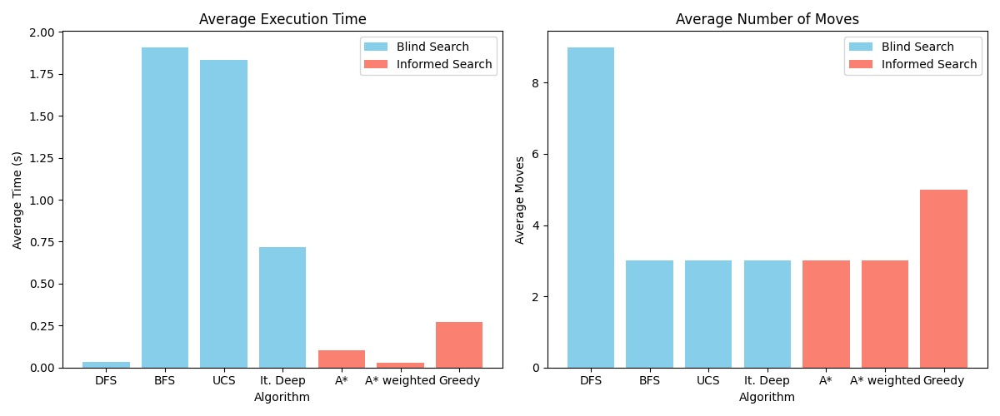

# Woody Block Search Algorithm

[](LICENSE)
[](#requirements)

Woody Block Search Algorithm is a modular Python framework designed to implement, benchmark, and compare classical uninformed and informed search strategies within the "Woody Block" puzzle environment. This project aims to:

* Showcase core AI search techniques in a unified setting
* Measure each algorithm’s performance: nodes expanded, solution depth, path cost, and runtime
* Provide an extensible platform for experimenting with new heuristics or search variants

## 🧩 Problem Formulation

The Woody Block Puzzle challenge in our environment is defined on a rectangular grid populated with static diamonds and a set of available block pieces of various shapes. The objective is to eliminate all diamonds by strategically placing pieces so that complete rows or columns are formed, which clears any diamonds in those lines.

* **States**: A pair $⟨S, D⟩$ where:

  * $S$ is an $n × n$ matrix representing placed blocks (1 for filled cells, 0 for empty).
  * $D$ is an $n × n$ binary matrix representing remaining diamonds.
* **Initial State**: $⟨S₀, D₀⟩$, where $S₀$ has no placed blocks, and $D₀$ encodes diamond positions from the level.
* **Actions**: Choose a block piece from the set and place it at a valid grid position (no overlap or out-of-bounds). Each piece may have multiple orientations.
* **Transition Model**: Deterministic—placing a piece updates $S$, then any fully occupied row or column in $S$ triggers removal of diamonds in those lines (setting corresponding entries in $D$ to 0).
* **Goal Test**: All diamonds cleared: $∑ᵢⱼ Dᵢⱼ = 0$.
* **Cost Function**: Each placement counts as one move (uniform cost). Extensions may assign weighted costs per piece or orientation.
* **Search Space Complexity**: Combinatorial growth based on grid size, diamond distribution, and piece set.

By modeling block placements and diamond-clear rules, we turn the puzzle into a classical search problem. Comparing uninformed strategies (BFS, DFS, IDS, UCS) with heuristic approaches (Greedy, A\*, Weighted A\*) highlights how heuristic guidance reduces exploration when diamonds are the clearing criterion.

## ⚙️ Key Features

* **Uninformed (Blind) Search**

  * Breadth‑First Search (BFS)
  * Depth‑First Search (DFS)
  * Iterative Deepening Search (IDS)
  * Uniform Cost Search (UCS)

* **Informed (Heuristic) Search**

  * Greedy Best‑First Search
  * A\* Search
  * Weighted A\* Search (W-A\*)

* Extensible simulation environment for custom block arrangements and goal states

* Performance logging with automatic metrics export

* Command-line interface for single experiments or batch comparisons

## 🏷️ Repository Structure

```
Woodblock_Algorithm/
├── assets/                 # Sample puzzles and visualization scripts
├── algorithms.py           # Base classes and shared utilities
├── blind_search.py         # Implementations of uninformed search methods
├── informed_search.py      # Implementations of heuristic-based search
├── simulation.py           # Environment setup, state definitions, and helpers
├── main.py                 # CLI entrypoint for running experiments
├── requirements.txt        # Python dependencies
├── LICENSE                 # Project license (MIT)
└── README.md               # Project documentation
```

## 🚀 Installation

1. **Clone the repository**:

   ```bash
   git clone https://github.com/alfredofdlv/Woodblock_Algorithm.git
   cd Woodblock_Algorithm
   ```
2. **(Optional) Create a virtual environment**:

   ```bash
   python3 -m venv venv
   source venv/bin/activate      # macOS / Linux
   venv\Scripts\activate       # Windows
   ```
3. **Install dependencies**:

   ```bash
   pip install -r requirements.txt
   ```

## 🔍 Algorithm Details

All search classes inherit from the `SearchAlgorithm` interface in `algorithms.py`. Key methods:

* `initialize(start_state)`: Prepare internal data structures
* `step()`: Expand one node, return status (`ongoing`, `success`, `failure`)
* `get_solution()`: Retrieve the solution path and metrics after completion

### Uninformed Searches

* **BFS**: Guarantees shallowest solution but uses more memory.
* **DFS**: Explores deep paths first; can be combined with depth limits.
* **IDS**: Repeated DFS with increasing depth limit; memory-efficient.
* **UCS**: Prioritizes lowest cumulative path cost; optimal for weighted moves.

### Heuristic Searches

* **Greedy Best‑First**: Selects nodes with smallest heuristic estimate to goal; fast but not optimal.
* **A**\*: Balances actual cost (`g`) and heuristic (`h`) via `f(n) = g(n) + h(n)`; optimal if heuristic is admissible.
* **Weighted A**\*: Applies weight `w` to heuristic term (`f(n)=g(n)+w*h(n)`), trading optimality for speed.

## 📊 Metrics & Output

By default, each experiment logs:

* Solution depth
* Path cost
* Execution time (seconds)

## 📈 Sample Results

Below is an example summary of our experimental findings:



* The **left chart** shows that informed searches (A\*, Weighted A\*, Greedy) typically run faster than blind searches, with A* weighted being the quickest on average.
* The **right chart** highlights that blind searches like DFS may use more moves in some cases, but informed strategies tend to balance move count and speed more consistently.

## In-Game Examples

```markdown

```

## 📄 License

This project is licensed under the MIT License. See the [LICENSE](LICENSE) file for details.

---
## ✉️ Contact

- **Author:** Alejandro Morís Lara & Alfredo Flórez de la Vega & Mateo Bouchet Agudo
- **GitHub:** [alejandromorislara](https://github.com/alejandromorislara) & [alfredofdlv](https://github.com/alfredofdlv) & [MateoBAS](https://github.com/MateoBAS)
- **Email:** alejandrgi2g@gmail.com
